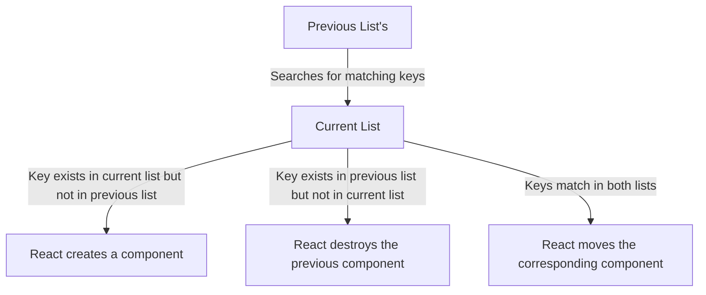

[[https://react.dev/learn/tutorial-tic-tac-toe]]
#react 
# Passing data through props
![[Pasted image 20230929210812.png]]
```js
function Square({ value }) {
  return <button className="square">{value}</button>;
}

export default function Board() {
  return (
    <>
      <div className="board-row">
        <Square value="1" />
        <Square value="2" />
        <Square value="3" />
      </div>
      <div className="board-row">
        <Square value="4" />
        <Square value="5" />
        <Square value="6" />
      </div>
      <div className="board-row">
        <Square value="7" />
        <Square value="8" />
        <Square value="9" />
      </div>
    </>
  );
}
```
`{value}` has been rendered through the component `Square` by curly braces `{value}`.
# Make interactive components
```js
function Square({ value }) {
  function handleClick() {
    console.log('clicked!');
  }

  return (
    <button
      className="square"
      onClick={handleClick}
    >
      {value}
    </button>
  );
}
```
![[Pasted image 20230929211344.png | Console display "clicked"]]

As a next step, you want the Square component to “remember” that it got clicked, and fill it with an “X” mark. To “remember” things, components use _state_.
## useState();
>React provides a special function called `useState` that you can call from your component to let it “remember” things

Each Square has its own state: the `value` stored in each Square is completely independent of the others. When you call a [[Set Function]] in a component, React automatically updates the child components inside too

```js
import { useState } from 'react';

function Square() {
  const [value, setValue] = useState(null);

  function handleClick() {
    //...
```
`value` stores the value and `setValue` is a function that can be used to ***change*** the value. ***null*** passed to `useState` is used as ***initial value*** for this state variable (`value` hence start off equal to `null`)

Now you’ll change `Square` to display an “X” when clicked. Replace the `console.log("clicked!");` event handler with `setValue('X');`. Now your `Square` component looks like this:
![[Pasted image 20230929212454.png | Set "X" when clicked]]
# Lifting state up %% fold %% 
Do declare the winner in a way that less susceptible to bugs. We will ***store the game's state in parent `Board`*** instead of each `Square`.
The `Board` component will tell each `Square` what ***to display*** by ***passing a prop*** (like you did pass a number to each Square)

> **To collect data from multiple children, or to have two child components communicate with each other, ==declare the shared state in their parent component instead==. The parent component can pass that state back down to the children via props. This keeps the child components in sync with each other and with their parent.**

`Array(9).fill(null)` creates an array with nine elements and sets each of them to `null`. The `useState()` call around it declares a `squares` state variable that’s initially set to that array. Each entry in the array corresponds to the value of a square. When you fill the board in later, the `squares` array will look like this:

```js
['O', null, 'X', 'X', 'X', 'O', 'O', null, null]
```

```js
// ...
export default function Board() {
  const [squares, setSquares] = useState(Array(9).fill(null));
  return (
    // ...
  );
}

export default function Board() {
  const [squares, setSquares] = useState(Array(9).fill(null));
  return (
    <>
      <div className="board-row">
        <Square value={squares[0]} />
        <Square value={squares[1]} />
        <Square value={squares[2]} />
      </div>
      <div className="board-row">
        <Square value={squares[3]} />
        <Square value={squares[4]} />
        <Square value={squares[5]} />
      </div>
      <div className="board-row">
        <Square value={squares[6]} />
        <Square value={squares[7]} />
        <Square value={squares[8]} />
      </div>
    </>
  );
}
```

`handleClick` function
```js
export default function Board() {
  const [squares, setSquares] = useState(Array(9).fill(null));

  function handleClick(i) {
    const nextSquares = squares.slice();
    nextSquares[i] = "X";
    setSquares(nextSquares);
  }

  return (
    // ...
  )
}
```
However, if you put `handleClick(0)` it will not work. Because, `handleClick` *alters* the state of board by calling `setSquares`. The entire board will be *re-rendered* again hence *created a infinite-loop* 
![[Pasted image 20231002033718.png | An infinite loop caused by function handleClick(0)]]
Why didn’t this problem happen earlier?

When you were passing `onSquareClick={handleClick}`, you were passing the `handleClick` function down as a prop. You were not calling it! But now you are _calling_ that function right away—notice the parentheses in `handleClick(0)`—and that’s why it runs too early. You don’t _want_ to call `handleClick` until the user clicks!

How to fix?

You could fix this by creating a function like `handleFirstSquareClick` that calls `handleClick(0)`, a function like `handleSecondSquareClick` that calls `handleClick(1)`, and so on. **You would pass (rather than call)** these functions down as props like `onSquareClick={handleFirstSquareClick}`. This would solve the infinite loop. ^096e78

```js
export default function Board() {
  // ...
  return (
    <>
      <div className="board-row">
        <Square value={squares[0]} onSquareClick={() => handleClick(0)} />
        // ...
  );
}
```
Notice the new `() =>` syntax. Here, `() => handleClick(0)` is an _arrow function,_ which is a shorter way to define functions. When the square is clicked, the code after the `=>` “arrow” will run, calling `handleClick(0)`.

Now you need to update the other eight squares to call `handleClick` from the arrow functions you pass. Make sure that the argument for each call of the `handleClick` corresponds to the index of the correct square:
```js
export default function Board() {
  const [squares, setSquares] = useState(Array(9).fill(null));

  function handleClick(i) {
    const nextSquares = squares.slice();
    nextSquares[i] = "X";
    setSquares(nextSquares);
  }
  return (
    <>
      <>
        <h1>Test "Set function"</h1>
        <Counter />
      </>
      <div className="board-row">
        <Square value={squares[0]} onSquareClick={() => {handleClick(0)}} />
        <Square value={squares[1]} onSquareClick={() => {handleClick(1)}}/>
        <Square value={squares[2]} onSquareClick={() => {handleClick(2)}}/>
      </div>
      <div className="board-row">
        <Square value={squares[3]} onSquareClick={() => {handleClick(3)}}/>
        <Square value={squares[4]} onSquareClick={() => {handleClick(4)}}/>
        <Square value={squares[5]} onSquareClick={() => {handleClick(5)}}/>
      </div>
      <div className="board-row">
        <Square value={squares[6]} onSquareClick={() => {handleClick(6)}}/>
        <Square value={squares[7]} onSquareClick={() => {handleClick(7)}}/>
        <Square value={squares[8]} onSquareClick={() => {handleClick(8)}}/>
      </div>
    </>
  );
}
```

Now that your state handling is in the `Board` component, the parent `Board` component passes props to the child `Square` components so that they can be displayed correctly. When clicking on a `Square`, the child `Square` component now asks the parent `Board` component to update the state of the board. When the `Board`’s state changes, both the `Board` component and every child `Square` re-renders automatically. Keeping the state of all squares in the `Board` component will allow it to determine the winner in the future.

## Recap
`Square` has `<button>` that has `onClick` prop
![[Pasted image 20231002034253.png]]
which runs `handleClick(i)`
![[Pasted image 20231002034412.png]]
![[Pasted image 20231002034431.png | Function handleClick(i) looks like]]
`handleClick(i)` will uses the argument (i) to update the element of the `squares` array from `null` to `X`

After that, the `squares` state of the `Board` component was updated, so the `Board` and all of its children re-render. This causes the `value` prop of the `Square` component with index `0` to change from `null` to `X`.
> In React, it's *conventional* to use `onSomething`names for props which **represent events** and `handleSomething` for **function definitions** which handle those events.
E.g: onClick() or `onSquareClick()` 
`handleClick()`

# Why immutability (sự không thay đổi) is important

![[Pasted image 20231002035025.png | Using slice() to create a copy array]]
Note how in `handleClick`, you call `.slice()` to create a copy of the `squares` array instead of modifying the existing array. To explain why, we need to discuss immutability and why immutability is important to learn.

There are two *approaches* to *changing DATA*. 
1. *mutate* DATA by directly changing data's value
2. *replace* DATA with a new copy which has the *desired changes* 

Here is how to do `(1)`:
```js

const squares = [null, null, null, null, null, null, null, null, null];
squares[0] = 'X';
// Now `squares` is ["X", null, null, null, null, null, null, null, null];
```
And here's how to do `(2)`:
```js

const squares = [null, null, null, null, null, null, null, null, null];
const nextSquares = ['X', null, null, null, null, null, null, null, null];
// Now `squares` is unchanged, but `nextSquares` first element is 'X' rather than `null`
```

**Immutability** makes complex features much easier to *implement*. For example: We can *implement* a *feature* which display & review the game's *history* and "jump back" to past moves. ***The ability to *undo* and *redo* certain actions is a common requirement for apps***. Avoid *direct DATA mutation* let's you keep the previous version of DATA intact, and ***reuse*** them later.

***Another benefit***: For *performance* reason, immutability helps skip *re-rendering* a part of a tree that clearly *was not affected by it* 

# Taking turns in game

Set the first move to be `X` by default. Let's add another *piece of state* to the `Board` component:
![[Pasted image 20231002040152.png]]
Each time a player moves, `xIsNext` (a boolean) will be *flipped* to `true` to determine which player goes next and the game's state *will be saved* 
![[Pasted image 20231002040622.png]]
Now, as you click on different squares, they will alternate between `X` and `O`, as they should!

However, it will flip the state of a `Square` if user click on it multiple times
To fix this, we need to *check if a Square already has "X" or "O"*. by using ***return early***. > If the square is already filled, you will `return` in the `handleClick` function early—before it tries to update the board state.

![[Pasted image 20231002041225.png]]

> [!condition] Condition
```js

if (squares[i] != null) {

return; // Return early if Square already has value

}
```
>This is equivalent to `if (squares[i])`, because in JavaScript, `null` is a falsy value. This means that when `null` is converted to a boolean context (like in an `if`statement), it becomes `false`. So, `if (squares[i])` will only proceed if `squares[i]` is not `null` (and also not any other falsy value like `undefined` or `false`).

# Declare winner
We will add a function called `calculateWinner` that *takes an array of 9 squares*, check for winner and return "X", "O", "null" as appropriate. This function is strictly *Javascript* based
![[Pasted image 20231002045819.png | Numbering board]]
```js

function calculateWinner(squares) {
  const lines = [
    [0, 1, 2],
    [3, 4, 5],
    [6, 7, 8],
    [0, 3, 6],
    [1, 4, 7],
    [2, 5, 8],
    [0, 4, 8],
    [2, 4, 6]
  ];
  for (let i = 0; i < lines.length; i++) {
    const [a, b, c] = lines[i];
    if (squares[a] && squares[a] === squares[b] && squares[a] === squares[c]) {
      return squares[a];
    }
  }
  return null;
```

You will *call* `calculateWinner(squares)` in the `Board` component's `handleClick` function to check if a player has won. You can perform this check at the time you *check if a user has clicked* a `Square`that already has `X` and `O`. We'd like to **return early** in *both* cases.
![[Pasted image 20231002051059.png | Return early when the Square already has value or player has won]]

To let the players know when the game is over, you can display text such as `“Winner: X” or “Winner: O”.` To do that you’ll add a `status` section to the `Board` component. The status will *display the winner* if the game is over and if the game is ongoing you’ll display which player’s turn is next:
![[Pasted image 20231002051227.png]]
# Adding time travel
## Storing a history of moves
Because we have already used `slice()` to *create a new copy of `Square`after every move*. Now, in order to store a history of moves, please create another Array called `history` which has the *shape* like this:
![[Pasted image 20231002052431.png | history.Array of moves]]
## Lifting state up, again
>[!abstract] Lifting state
>Now write a new **top-level** component called `Game` to *display a list of past moves*. That's where you will place the `history` state of that contains the entire game history

Placing the `history` state into the `Game` component will let you remove the `squares` state from its child `Board` component. Just like you “lifted state up” from the `Square` component into the `Board` component, you will now lift it up from the `Board` into the top-level `Game` component. This gives the `Game` component full control over the `Board`’s data and lets it instruct the `Board` to render previous turns from the `history`.

1. Add a `Game` component with `export defalut`. Have it *render the `Board`* component and some markup
![[Pasted image 20231002053038.png|350]]
>[!info] Note
>Note that you are removing the `export default` keywords before the `function Board() {` declaration and adding them before the `function Game() {` declaration. This tells your `index.js` file to use the `Game` component as the top-level component instead of your `Board` component.

To render the square from the current move, you'll want to read **the last `Square` array*** from the `History`. *Don't need to useState for this*-you already have enough information to calculate it during rendering.

![[Pasted image 20231002054055.png|600]]
>[!tip]- About history length -1 
> We put (-1) because the Array start with 0

Next, create `handlePlay` function inside `Game` component that will be *called* by `Board`component to *update* the game. Remember to *pass* `xIsNext`, `currentSquares` and `handlePlay` as props to the `Board` component:

```js
export default function Game() {
  const [xIsNext, setXIsNext] = useState(true);
  const [history, setHistory] = useState([Array(9).fill(null)]);
  const currentSquares = history[history.length - 1];

  function handlePlay(nextSquares) {
    // TODO
  }

  return (
    <div className="game">
      <div className="game-board">
        <Board xIsNext={xIsNext} squares={currentSquares} onPlay={handlePlay} />
        //...
  )
}
```

Let's make `Board` component fully controlled by the props it receives. 
![[Pasted image 20231002054651.png| Add props to Board for controls]]

`onPlay()` is new *function* which `Board` calls with the updated squares array *when player make a move*

Now replace `setSquares(nextSquares)` and `setXIsNext`calls in `handleClick`in the `Board` *component* with a **single call** to the new `onPlay`function so that `Game` *component* can update the `Board` when **user clicks a square**
![[Pasted image 20231002055249.png|500]]
The `Board` is fully controlled by props passed by `Game` component. 
To get the game working again, needed to *implement* the `handlePlay` function in the `Game` component 
![[Pasted image 20231002055708.png]]
The `handlePlay` needs to:
* Update `Game`'s state to **trigger a re-render** by using `History` state variable
	* Update `history` by appending the **updated** `square` Array as a *new history entry*.
		* `[...history, nextSquares]` Creates a new Array that contains all the items in `history`, followed by `nextSquares`.
	* Toggle `xIsNext` 
![[Pasted image 20231002055859.png || Appending Square array + toggle X]]

>[!tip]+ Spread Sytax
> You can read the [...history] *spread syntax* as "enumerate all the item in `history`"
> 
> For example, if `history` is `[[null,null,null], ["X",null,null]]` and `nextSquares` is `["X",null,"O"]`, then the new `[...history, nextSquares]` array will be `[[null,null,null], ["X",null,null], ["X",null,"O"]]`.

## Display past moves
>[!info]+ Button
> React Element like `<button>` is regular JavaScript object. You can pass them around in your application. To render multiple items, you can use ***array of Reacts elements***

You already have *an Array of `History`moves* in state, so now you need to ***transform*** it to an array of *React elements*. By using ***Map*** method
```js

[1, 2, 3].map((x) => x * 2) // [2, 4, 6]

```
[[array.Map();]]

### Using Map() method to transform Array to list of Element
![[Pasted image 20231002062707.png]]
> [!info]+ Code
> The `Map` function takes a callback function as an argument, which is called for each element in the `history`array. The callback function takes two parameters: the current element being processed (square) and its index(move)
> 
> Square() represents the state of the Game board at a certain moves
> Move() represents the move number
> 
> Inside the callback function, a description is created based on the move number. If `move` is greater than 0, it means it’s not the start of the game, so the description is `Go to move ${move}`. If `move` is 0, it means it’s the start of the game, so the description is `Go to game start`.
> 
> Then, for each element in the `history` array, a new `<li>` element is returned containing a `<button>` element. The button’s text is set to the description, and when clicked, it calls the `jumpTo` function with `move` as an argument. This allows players to jump to any move in the history of the game.
> 
> Finally, these `<li>` elements are rendered inside an `<ol>` element in the returned JSX.


As you iterate through `history` array inside the function you passed to `map`, the `squares` argument goes through each element of `history`, and the `move` argument goes through each array index: `0`, `1`, `2`, …. (In most cases, you’d need the actual array elements, but to render a list of moves you will only need indexes.)

For now, you should see a list of the moves that occurred in the game and an error in the developer tools console. Let’s discuss what the “key” error means.

### Picking a key
When you render a list, React *stores* some *information* about *each rendered list items*. When you update a list, React *needs to determine* what *has changed* 
You could have added, removed, re-arranged or updated the list's item!

Imagine transitioning from

```js
<li>Alexa: 7 tasks left</li>
<li>Ben: 5 tasks left</li>
```

to

``` js
<li>Ben: 9 tasks left</li>
<li>Claudia: 8 tasks left</li>
<li>Alexa: 5 tasks left</li>
```
In addition to the updated counts, a human reading this would probably say that you swapped Alexa and Ben’s ordering and inserted Claudia between Alexa and Ben. However, React is a computer program and does not know what you intended, so you need to ==specify a _key_ property for each list item to differentiate each list item from its siblings.== If your data was from a database, Alexa, Ben, and Claudia’s *database IDs* could be used as keys.

![[Pasted image 20231002064134.png | Scripted React language for this concept]]

When a list is re-rendered, *React* takes each *list item's key* and searches the *previous list's items* for a **matching key**. If the current list has a key that didn’t exist before, React creates a component. If the current list is missing a key that existed in the previous list, React destroys the previous component. If two keys match, the corresponding component is moved.

Keys tell React about the identity of each component, which allows React to maintain state between re-renders. If a component’s key changes, the component will be destroyed and re-created with a new state.

`key` is a special and reserved property in React. When an element is created, React extracts the `key` property and stores the key directly on the returned element. Even though `key` may look like it is passed as props, React automatically uses `key` to decide which components to update. There’s no way for a component to ask what `key` its parent specified.
>[!caution] Key
> It is **strongly** recommended that you ***assign proper keys*** whenever you ***build dynamic lists***
> 
> If you don't have an appropriate key, you may want to consider restructuring your data so that you do
> If no `key` is specified, `React` will report an error and use the array index as a key by default.
> 
> Using the array index as a key is problematic when trying to re-order a list’s items or inserting/removing list items. Explicitly passing `key={i}` silences the error but has the same problems as array indices and is not recommended in most cases.
> 
> Keys do not need to be globally unique; they only need to be unique between components and their siblings. 
### Implementing time travel
In the game's history, each past move has ***a unique ID associated with it***: it's the sequential number of move. Move will never be re-order, deleted or inserted in the middle so it's **safe** to use *move index* as a **key**
![[Pasted image 20231002064134.png | Scripted React language for this concept]]
![[Pasted image 20231002065616.png]]
Before you can implement `jumpTo()`. You need the `Game` component to keep track of which step the user is currently viewing. To do this, define a new state variable called `currentMove` and default to 0;
![[Pasted image 20231002070115.png]]
Update `jumpTo()` so that it can `setCurrentMove` to the move that user clicked
Also set `xIsNext` to `true`(A Truthy value) if the number of the move is *even* 
![[Pasted image 20231002070035.png|444]]
You will now make two changes to `Game` 's `handlePlay` function which is called when you *click on a square*
* If you *go back in time* and then make a new move from that point, you only want to ***keep the history up to that point***. Instead of adding `nextSquares` after (`...`- spread syntax) in `history`, you will add if after all items in `history.slice(0, currentMove + 1)` so that you're only ***keeping that portion*** of the old history. 
* Each time a new move is made, you need to *update* `currentMove` to the point of ***latest history entry*** 
* ![[Pasted image 20231009030253.png]]
#### Code explanation
> [!abstract]-  Further explanation
> Certainly! Let's break down the code and the changes being made step by step:
> https://chat.openai.com/c/0cba0082-5e68-402d-9b33-51ce63a70c6b

**Original Code:**

```javascript
function handlePlay(nextSquares) {
  const nextHistory = [...history.slice(0, currentMove + 1), nextSquares];
  setHistory(nextHistory);
  setCurrentMove(nextHistory.length - 1);
  setXIsNext(!xIsNext);
}
```

1. The `handlePlay` function is called when a player makes a move by clicking on a square in the game.

2. It receives `nextSquares`, which likely represents the state of the game board after the current move.

3. The goal of these changes is to update the game's history of moves correctly:

   - Before making any changes, it's important to understand that the game's history is stored in an array called `history`. Each item in this array represents a snapshot of the game board at a specific point in time.

**Changes Explained:**

- `const nextHistory = [...history.slice(0, currentMove + 1), nextSquares];`

   - `history.slice(0, currentMove + 1)`: This part takes a portion of the `history` array. It starts from the beginning (index 0) and goes up to the current move (`currentMove`) plus one. This means it includes all moves from the start up to and including the current move.

   - `[...history.slice(0, currentMove + 1), nextSquares]`: This line creates a new array `nextHistory` by combining the portion of the old history and the `nextSquares` (the new move). It effectively replaces the history from the current move onward with the new move, essentially "forgetting" the future moves if you've gone back in time.

- `setHistory(nextHistory)`: This line updates the `history` state with the new `nextHistory` array, which represents the correct history up to the current move.

- `setCurrentMove(nextHistory.length - 1)`: It sets the `currentMove` to the index of the latest move in the new history, ensuring that it points to the most recent move.

- `setXIsNext(!xIsNext)`: This line likely toggles which player's turn it is for the next move. If `xIsNext` is `true`, it sets it to `false`, and vice versa.
#### .
Finally, you will modify the Game component to render the currently selected move, instead of always rendering the final move:

```js
export default function Game() {
  const [xIsNext, setXIsNext] = useState(true);
  const [history, setHistory] = useState([Array(9).fill(null)]);
  const [currentMove, setCurrentMove] = useState(0);
  const currentSquares = history[currentMove];

  // ...
}
```
If you click on any step in the game’s history, the tic-tac-toe board should immediately update to show what the board looked like after that step occurred.
